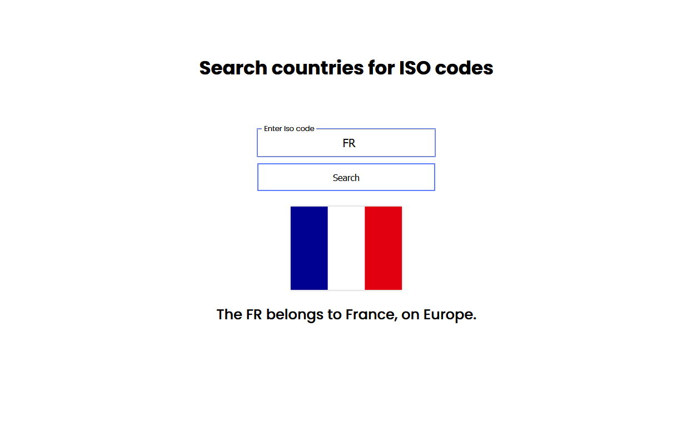

# Country ISO Codes Searcher

A simple app to look for country names using the ISO codes. It can also display the corresponding flag. 

[Click here](https://gregorim04.github.io/country-iso-code-searcher/) or the picture below to check the live page.

